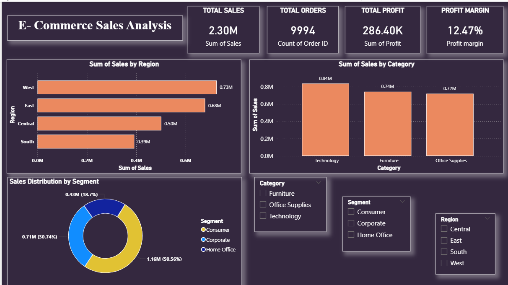

# E-Commerce Sales Analysis Dashboard

Power BI dashboard analyzing 9,994 retail transactions to uncover sales trends, regional performance, customer segments, and profitability drivers.

📊 **Dashboard Screenshot:**

📊 **Business Insights & Recommendations:**

## 📊 Key Metrics
- Total Sales: $2.30M
- Total Orders: 9,994
- Total Profit: $286K
- Profit Margin: 12.47%

## 🚀 Dashboard Features
- KPI Cards
- Region-wise Sales Analysis
- Category-wise Sales Analysis
- Segment-wise Sales Analysis
- Interactive Slicers

## 📊 Key Insights
- West region generated the highest sales revenue
- South region showed the weakest sales performance
- Technology category contributed the highest revenue and profit
- Consumer segment was the largest contributor to overall sales
- Phones and Chairs were among the top-performing product groups

## 💡 Business Recommendations
- Replicate successful sales strategies from the West region in the South region
- Increase marketing investment in low-performing regions
- Expand focus on Technology products due to strong profitability
- Strengthen customer engagement within the Consumer segment
- Monitor underperforming product categories and optimize inventory

## 📝 Executive Summary
The business generated $2.30M in sales and $286K in profit across 9,994 orders. Sales performance was strongest in the West region, while the Consumer segment and Technology category emerged as key growth drivers. Strategic focus on underperforming regions and high-margin product categories can further improve profitability.

## 🛠️ Tech Stack
Excel · Power BI

## ⚙️ How to View
1. Download the `.pbix` file from this repo
2. Open in Power BI Desktop
*(GitHub can't render `.pbix` directly — screenshots above show the live dashboard)*

## 👩‍💻 Built By
**Prachi Jain** — Data Analyst
[LinkedIn](https://linkedin.com/in/prachi-jain-524a95251) 
